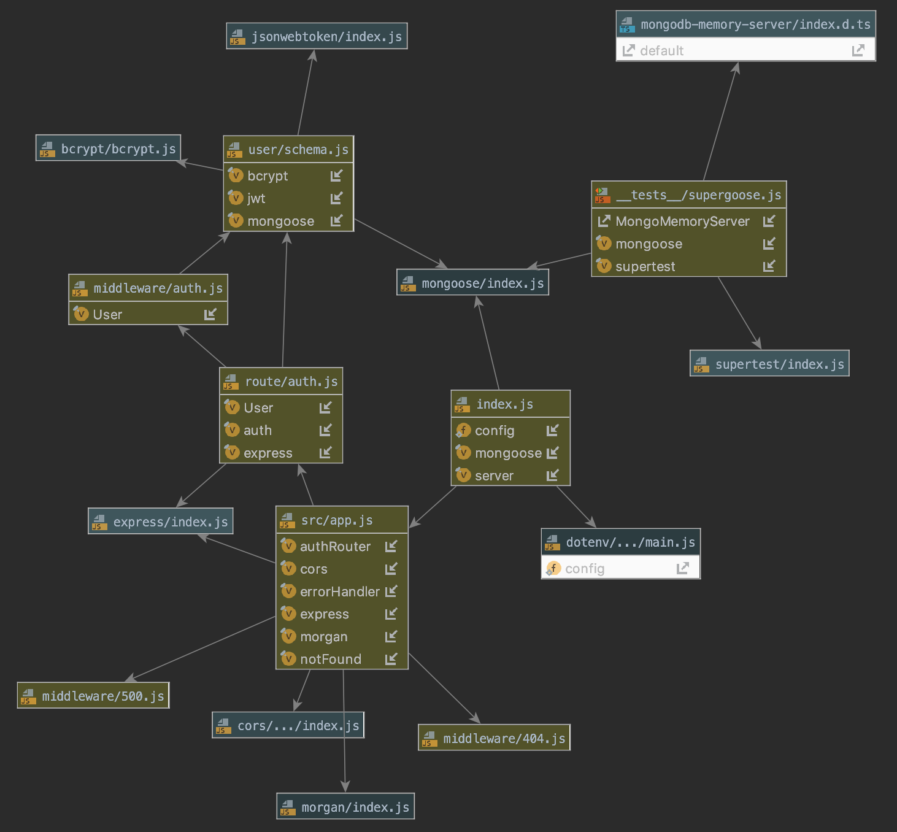

# Week 8 Project

## API / Auth Server

### Author: Austin Hedeen

### Links and Resources
* [Server Deployment](https://intense-springs-89759.herokuapp.com/)
* [Travis](https://travis-ci.com/austinhedeen-401-advanced-javascript/week-8-back-end)
* [PR - Day 1 (Setup/Config)](https://github.com/austinhedeen-401-advanced-javascript/week-8-back-end/pull/1)
* [PR - Day 2 (API Auth)](https://github.com/austinhedeen-401-advanced-javascript/week-8-back-end/pull/2)
* [PR - Day 3 (API Resources)](https://github.com/austinhedeen-401-advanced-javascript/week-8-back-end/pull/3)

#### Documentation
* [JSDoc](https://intense-springs-89759.herokuapp.com/docs)

### Modules
#### `app.js`
##### Exported Values and Methods

###### `start(port)`
Starts the server on the given port

##### `server`
The server instance for use in testing

### Setup
#### `.env` requirements
* `MONGODB_URI` - URL to the running mongo instance/db
* `PORT` - Port number to start the server

#### Running the app
* `npm start`
  
#### Tests
* `npm test`

#### UML

